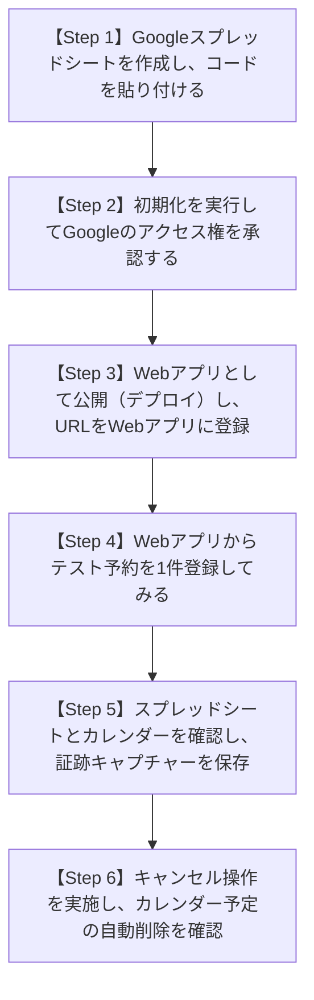

# Mauro & Brenda Taxi Link
# Google連携（スプレッドシート＆カレンダー）手動受入検証 手順書

> **本書の目的**  
> 本システムにおけるGoogleスプレッドシートおよびGoogleカレンダーとの自動連携機能について、技術的な知識がない方（先生方・教室スタッフ様）でも迷わず1ステップずつ実施でき、実際の画面でデータが連携されたことを確認して「合格証跡」を残すための公式手順書です。  
> **本手順を実施し、指定の画面キャプチャー2〜3枚を取得・貼付した時点で、Google連携機能（TC-G01〜G06）の正式合格（Pass）となります。**

---

## ▍事前準備（必要なもの）

1. **パソコン（Windows または Mac）**
2. **インターネットブラウザ（Google Chrome 推奨）**
3. **教室または先生の Google アカウント（Gmail）**
   * 例: Mauro先生、Brenda先生、または教室管理用のアカウント
4. **送迎チケット管理WebアプリのURL**
   * [https://kanta13jp1.github.io/eigo-taxi-management/](https://kanta13jp1.github.io/eigo-taxi-management/)

---

## ▍作業の流れ（全体で約10〜15分）

---

## ▍詳細手順（ステップ・バイ・ステップ）

### 【Step 1】Googleスプレッドシートの新規作成とコードの貼り付け

1. お使いのパソコンで **Google Chrome** を開き、連携させたい Google アカウントにログインします。
2. [Google ドライブ](https://drive.google.com/) または [Google スプレッドシート](https://sheets.new) を開きます。
3. 画面左上の「**+ 空白のスプレッドシート**」をクリックして新しいシートを作成します。
4. 画面左上のタイトル「無題のスプレッドシート」をクリックし、わかりやすい名前を入力します。  
   * 例: `英語教室_送迎チケット管理データベース`
5. 画面上部のメニューバーから **「拡張機能」 ➜ 「Apps Script」** をクリックします。
   * 新しいタブで「無題のプロジェクト」というスクリプト編集画面が開きます。
6. [送迎チケット管理Webアプリ](https://kanta13jp1.github.io/eigo-taxi-management/) を別のタブで開き、上部タブの **「Google連携」** をクリックします。
7. 画面右上の緑色ボタン **「📋 スクリプトをコピー」** をクリックします（「コピー完了！」と表示されます）。
8. 先ほどの Apps Script 画面に戻り、最初から書かれている `function myFunction() { ... }` をすべて削除（BackSpace）して空にします。
9. コピーした内容を貼り付けます（Windows: `Ctrl + V` / Mac: `Cmd + V`）。
10. 画面上部にある **フロッピーディスクのアイコン（プロジェクトを保存）** をクリックします。

---

### 【Step 2】3つのシートの自動生成と、Googleのアクセス承認

このステップを行うと、スプレッドシートに「生徒台帳」「送迎予定履歴」「チケット購入履歴」の3つの専用シートが色付きで一瞬で自動作成されます。

1. Apps Script 画面の上部にある実行関数の選択プルダウン（現在は `doGet` や空欄になっている部分）をクリックし、**`initSpreadsheet`** を選択します。
2. その左隣にある **「▷ 実行」** ボタンをクリックします。
3. 画面に **「承認が必要です」** というポップアップが表示されますので、青色の **「権限を確認」** ボタンをクリックします。
4. ご利用の Google アカウントを選択します。
5. **【最重要ポイント】「Google で確認されていないアプリ」という警告画面が出ます（これは自作スクリプトを初回実行する際にGoogleが必ず表示する安全確認です。不具合ではありません）。**
   * 画面左下にある小さな文字 **「詳細」**（または「Advanced」）をクリックします。
   * 下部に現れる **「無題のプロジェクト（安全ではないページ）に移動」** をクリックします。
6. 次の画面で右下の青色ボタン **「許可」** をクリックします。
7. 画面下の実行ログに「実行完了」と表示されます。
8. スプレッドシートのタブに戻ってみてください。画面下に **「生徒台帳（緑色）」「送迎予定履歴（青色）」「チケット購入履歴（紫色）」** の3枚のシートが自動作成されていることが確認できます！

> 📸 **【証跡 1 の撮影ポイント】**  
> スプレッドシートに3つのシート（生徒台帳、送迎予定履歴、チケット購入履歴）が生成された画面全体のスクリーンショットを撮影してください。

---

### 【Step 3】Webアプリとして公開（デプロイ）し、URLを連携

1. Apps Script の画面に戻り、画面右上にある青い **「デプロイ」 ➜ 「新しいデプロイ」** をクリックします。
2. 開いた画面の左上にある歯車アイコン（種類の選択）をクリックし、**「ウェブアプリ」** を選択します。
3. 以下の通り設定します（**「アクセスできるユーザー」を全員にすることが最大のポイントです**）：
   * **説明**: `送迎チケット管理連携 v1`（任意でOK）
   * **次のユーザーとして実行**: `自分 (your-email@gmail.com)`（初期値のままでOK）
   * **アクセスできるユーザー**: **「全員 (Anyone)」** を選択してください。
4. 右下の青色ボタン **「デプロイ」** をクリックします。
5. 画面に **「ウェブアプリ」** のURL（`https://script.google.com/macros/s/.../exec`）が表示されます。
   * 「**コピー**」ボタンをクリックしてこのURLをコピーします。
6. [送迎チケット管理Webアプリ](https://kanta13jp1.github.io/eigo-taxi-management/) の「Google連携」タブに戻ります。
7. 「**2. GAS WebアプリURLの入力**」の枠内に、コピーしたURLを貼り付けます。
8. 青色の **「💾 接続設定を保存」** ボタンをクリックします（「設定を保存しました！」と緑色で表示されます）。

---

### 【Step 4】Webアプリからテスト予約を1件登録してみる

1. Webアプリの画面上部タブで **「送迎利用者用（保護者）」** をクリックします。
2. 生徒選択で「**山本 颯太 (そうた)**」を選択します。
3. 青色の **「＋ 送迎の予約を申し込む」** ボタンをクリックします。
4. 以下の内容で入力して登録します：
   * **送迎日**: 明日または来週の日付
   * **お迎え時間**: `16:30`
   * **送迎区分**: `行き（お迎え）`
   * **メモ**: `Google連携テスト予約`
5. 緑色の **「送迎予定を登録する」** ボタンをクリックします。
6. 「予約が完了しました！」と表示され、予約中一覧に登録されます。

---

### 【Step 5】スプレッドシートとカレンダーを確認し、合格証跡を保存

#### A. Googleスプレッドシートの確認
1. 先ほどの Google スプレッドシートを開き、下のタブから **「送迎予定履歴」** を開きます。
2. **Step 4 で登録した「山本 颯太」くんの予約データ（日付、16:30、行き、scheduled 等）が1行追加されていることを確認します。**

> 📸 **【証跡 2 の撮影ポイント】**  
> スプレッドシートの「送迎予定履歴」に、Webアプリから登録したデータが正しく書き込まれている行が見えるようにスクリーンショットを撮影してください。

#### B. Googleカレンダーの確認
1. ブラウザで [Google カレンダー](https://calendar.google.com/) を開きます。
2. Step 4 で指定した日付・時間（16:30）の枠を確認します。
3. **『🚗【送迎】山本 颯太 (そうた) (pickup)』というタイトルの予定が自動登録されていることを確認します。**
4. 予定をクリックすると、メモ欄に送迎先住所や「Google連携テスト予約」が記載されていることを確認します。

> 📸 **【証跡 3 の撮影ポイント】**  
> Googleカレンダーの週表示または月表示で、『🚗【送迎】山本 颯太』の予定が表示されている画面のスクリーンショットを撮影してください。

---

### 【Step 6】キャンセル操作と、カレンダー予定の自動削除の確認

1. Webアプリの「送迎利用者用」画面に戻ります。
2. 先ほど登録した予約カードにある **「キャンセル」** ボタンをクリックします。
3. 「この送迎予約をキャンセルしますか？（先生のカレンダーからも自動で削除されます）」と表示されるので「**OK**」をクリックします。
4. Google カレンダーを開いて画面を再読み込み（F5）します。
   * 先ほど登録されていた **『🚗【送迎】山本 颯太』の予定が綺麗に消えていることを確認します。**
5. Google スプレッドシートの「送迎予定履歴」を確認します。
   * 該当の行のステータス列が `scheduled` から **`cancelled`** に自動更新されていることを確認します。

> 📸 **【証跡 4 の撮影ポイント】**  
> カレンダーから予定が自動消去され、スプレッドシートのステータスが `cancelled` に更新された画面のスクリーンショットを撮影してください。

---

## ▍手動受入検証 チェックシート & 判定表

以下の4つの証跡画像が揃った時点で、Google連携機能（TC-G01〜G06）の**【正式合格（Pass）】**となります。

| 検証項目 | 確認内容 | 必要な証跡キャプチャー | 判定欄 |
| :--- | :--- | :--- | :---: |
| **① シート自動生成** | `initSpreadsheet` 実行後、生徒台帳・送迎予定履歴・購入履歴の3シートが作成されたか | スプレッドシート画面の全景（下部タブ3つが見える状態） | [ ] 合格 |
| **② 予約連動（シート）** | Webアプリから予約登録後、「送迎予定履歴」に即座に1行追加されたか | 「送迎予定履歴」シートの追加行キャプチャー | [ ] 合格 |
| **③ 予約連動（カレンダー）** | Webアプリから予約登録後、Googleカレンダーに『🚗【送迎】生徒名』が登録されたか | Googleカレンダーの予定枠キャプチャー | [ ] 合格 |
| **④ キャンセル連動** | Webアプリでキャンセル後、カレンダーから予定が消え、シートが `cancelled` になったか | 予定削除後のカレンダー／シート更新画面 | [ ] 合格 |

* **検証実施日**: 2026年 _____月 _____日
* **検証実施者（ご署名）**: __________________________
* **使用したGoogleアカウント**: __________________________
* **総合判定**: [  ] 合格 (Pass)  /  [  ] 再確認要 (Fail)
