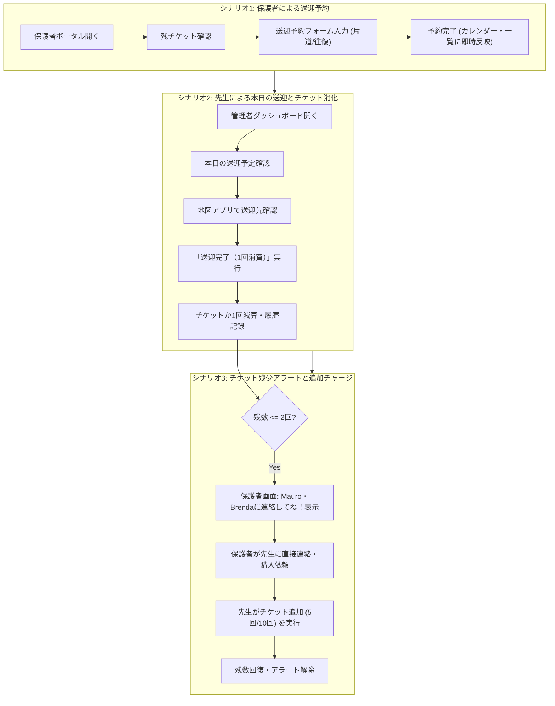

# Mauro & Brenda Taxi Link 全ユーザー操作シナリオテスト仕様書

本仕様書は、英語教室 送迎チケット管理システム「**Mauro & Brenda Taxi Link**」におけるすべてのユーザー操作とビジネスロジックを網羅したシナリオテストケースです。
実機（スマートフォン・PC）での受入テスト（UAT）および自動テスト設計の基準として利用します。

---

## 1. テスト対象アクター & ロール定義

| アクター | 主な利用シーン・役割 |
| :--- | :--- |
| **A: 管理者 (Mauro先生・Brenda先生)** | 本日の送迎確認、送迎完了によるチケット消化、新規生徒登録、チケットチャージ、急な送迎登録、地図案内 |
| **B: 送迎利用者 (生徒・保護者)** | チケット残数確認、残少アラート確認、送迎フレックス予約（前日・当日）、予約キャンセル、履歴閲覧 |
| **C: システム管理者 (運用・設定)** | Googleスプレッドシート初期化、GAS WebアプリURL設定、カレンダー連携、データリセット |

---

## 2. 全体シナリオテストマトリクス

---

## 3. 詳細シナリオテストケース一覧

### ▍カテゴリ 1: 送迎利用者（生徒・保護者ポータル）の操作

| ID | テストケース名 | 前提条件 | 操作手順 | 期待される結果（合格基準） | 判定 |
| :--- | :--- | :--- | :--- | :--- | :---: |
| **TC-P01** | 生徒切り替え | 複数生徒が登録されている | 画面上部の「表示する生徒」プルダウンから別の生徒を選択する | ・選択した生徒のチケット残高、予約一覧、過去履歴が即座に切り替わること。 | [ ] |
| **TC-P02** | チケット残数表示（余裕時） | 対象生徒の残チケットが3回以上 | 保護者ポータルを開く | ・残回数が大きく表示されること。 ・「片道1回につきチケット1枚消費」の説明が表示されること。 ・警告アラートが表示されないこと。 | [ ] |
| **TC-P03** | チケット残少アラート表示 | 対象生徒の残チケットが2回以下 | 山本 颯太さん（残1回）などを選択する | ・黄色警告枠で「⚠️ チケットが無くなりそうです（残り○回）」と表示されること。 ・**「Mauro・Brenda に連絡してね！」** という指定文言が表示されること。 | [ ] |
| **TC-P04** | チケット残ゼロ時の表示 | 対象生徒の残チケットが0回 | 高橋 莉子さん（残0回）を選択する | ・残回数「0回分」と表示され、チケット残少アラートが表示されること。 | [ ] |
| **TC-P05** | 送迎予約（お迎え・片道） | チケット残数1回以上 | 1. 「送迎の予約を申し込む」をクリック 2. 日付・時間・「行き（お迎え）」を選択 3. 送迎場所とメモを入力して「送迎予定を確定する」をクリック | ・モーダルが閉じ、予約一覧に「お迎え（教室へ）」バッジ付きで即時表示されること。 ・この時点では**チケット残数は減算されない**こと（完了時に引くため）。 | [ ] |
| **TC-P06** | 送迎予約（送り・片道） | チケット残数1回以上 | 送迎区分で「帰り（送り）」を選択して予約登録 | ・予約一覧に「送り（ご自宅へ）」バッジ付きで登録されること。 | [ ] |
| **TC-P07** | 送迎予約（往復） | チケット残数2回以上 | 送迎区分で「往復」を選択して予約登録 | ・「チケット2枚消費」の明記を確認し、正常に登録されること。 | [ ] |
| **TC-P08** | 保護者による自己キャンセル | 予約中（scheduled）の送迎がある | 該当予約の「キャンセル」ボタンをクリックし、確認ダイアログで「OK」を選択 | ・送迎一覧から予約中が消え、「過去の利用履歴」に「キャンセル」として記録されること。 ・チケットは消化されないこと。 | [ ] |
| **TC-P09** | 過去履歴の確認 | 完了済み・キャンセル済みの送迎がある | 保護者ポータル下部の「過去の利用履歴」を確認 | ・日付、時間、送迎種別、および「送迎済 (-1回)」または「キャンセル」のステータスが時系列で正しく表示されること。 | [ ] |

---

### ▍カテゴリ 2: 管理者（Mauro & Brenda 先生用画面）の操作

| ID | テストケース名 | 前提条件 | 操作手順 | 期待される結果（合格基準） | 判定 |
| :--- | :--- | :--- | :--- | :--- | :---: |
| **TC-T01** | 本日の送迎サマリー確認 | 本日の送迎予定が存在する | 「管理者用 (Mauro・Brenda)」タブを選択 | ・上部バナーに「Mauro・Brenda 先生用管理ダッシュボード」と表示されること。 ・「本日の送迎」カードに予定件数が正しく集計されていること。 | [ ] |
| **TC-T02** | 送迎完了処理（1回消費） | 本日予定のステータスが「scheduled」 | 該当カードの「送迎完了（1回消費）」ボタンをクリック | ・ボタンが「送迎完了 (消化済)」バッジに変わり、カードが薄グレー（完了状態）になること。 ・**該当生徒のチケット残高が即座に1回分減算されること**。 ・完了件数カウントが増加すること。 | [ ] |
| **TC-T03** | 送迎先地図アプリ連動 | 送迎先住所が登録されている | 送迎カード内の「地図アプリ」リンクをクリック | ・Google Mapsが新規タブで開き、指定の送迎先住所が正しくピン留め検索されること。 | [ ] |
| **TC-T04** | 先生側からの急な送迎登録 | - | 1. 右上「送迎予定を追加」をクリック 2. 生徒を選択（登録住所が自動セットされるか確認） 3. 日時・区分を入力して登録 | ・本日の送迎一覧、および全件スケジュールに即座に反映されること。 ・生徒変更時に住所が自動補完されること。 | [ ] |
| **TC-T05** | 新規生徒の登録 | - | 1. 「生徒・チケット管理」タブを開く 2. 「＋ 新規生徒登録」をクリック 3. 生徒名・保護者名・電話・住所・初期チケット数を入力して保存 | ・生徒一覧に新規生徒が追加されること。 ・保護者ポータルのプルダウンにも即座に選択肢として反映されること。 | [ ] |
| **TC-T06** | チケットチャージ（追加購入） | 生徒一覧または右上の「チケット追加」 | 1. 「チケット追加」ボタンをクリック 2. 生徒を選択し「10回券 (¥10,000)」を選択して登録 | ・対象生徒のチケット残高が `+10` されること。 ・残少だった場合、アラートが即座に解除されること。 | [ ] |
| **TC-T07** | 送迎予定一覧のステータス絞り込み | 送迎データが複数存在する | 「送迎スケジュール一覧」タブで「すべて」「予約中」「完了済み」「キャンセル」のフィルターを切り替える | ・選択したステータスに該当する送迎のみが正確に一覧表示されること。 | [ ] |
| **TC-T08** | 先生による送迎キャンセル | 未完了の送迎がある | 送迎一覧の右端にある「キャンセル」ボタンをクリック | ・ステータスが「キャンセル」に変更され、チケットが減算されないこと。 | [ ] |

---

### ▍カテゴリ 3: 結合・双方向同期・データ整合性シナリオ

| ID | テストケース名 | 前提条件 | 操作手順 | 期待される結果（合格基準） | 判定 |
| :--- | :--- | :--- | :--- | :--- | :---: |
| **TC-I01** | 保護者予約 → 先生完了の完全往復 | 生徒A（チケット残5） | 1. 保護者ポータルで本日のお迎えを予約 2. 先生画面を開き、本日の送迎に予約が表示されることを確認 3. 先生が「送迎完了（1回消費）」をクリック 4. 再度保護者画面に戻る | ・生徒Aのチケット残高が「4回分」になっていること。 ・保護者側の「現在予約中の送迎」から消え、「過去の利用履歴」に送迎完了として表示されること。 | [ ] |
| **TC-I02** | チケット切れ境界値テスト | チケット残1回の生徒 | 1. 先生が送迎完了を実行（残数1 → 0） 2. 保護者ポータルを確認 3. 先生が5回券を追加チャージ（残数0 → 5） 4. 再度保護者ポータルを確認 | ・残数0になった時点で「⚠️ チケットが無くなりそうです。Mauro・Brenda に連絡してね！」が表示されること。 ・チャージ後にアラートが消え「5回分」と通常表示になること。 | [ ] |
| **TC-I03** | ページリロード時の永続性検証 | 一連の予約・消化操作を実施 | ブラウザ（Edge/Chrome/Safari）でページをハード再読み込み（Ctrl+F5）する | ・直前に行った送迎予約、チケット残数減算、チャージ内容が消えずに保持されていること。 | [ ] |

---

### ▍カテゴリ 4: Googleスプレッドシート & Googleカレンダー連携（GAS）

| ID | テストケース名 | 前提条件 | 操作手順 | 期待される結果（合格基準） | 判定 |
| :--- | :--- | :--- | :--- | :--- | :---: |
| **TC-G01** | GASコードコピー & 手順表示 | 「Google連携」タブ | 1. 「Google連携」タブをクリック 2. 「スクリプトをコピー」ボタンをクリック | ・クリップボードにGASの全ソースコードが正確にコピーされること。 ・1〜4の手順が明確に読めること。 | [ ] |
| **TC-G02** | スプレッドシート初期化（GAS側） | Googleスプレッドシート新規作成 | Apps Scriptに貼り付け後、関数 `initSpreadsheet` を実行 | ・「生徒台帳」「送迎履歴」「チケット購入履歴」の3シートがヘッダー付きで自動生成されること。 | [ ] |
| **TC-G03** | GAS WebアプリURL設定と接続 | GASをウェブアプリとしてデプロイ完了 | 発行されたWebアプリURLを画面の入力欄に貼り付け、「設定を保存」をクリック | ・URLが保存され、「接続確認に成功しました」等のトースト/表示がされること。 | [ ] |
| **TC-G04** | カレンダー自動登録連携 | GAS連携済み環境 | Web画面から送迎予約を登録 | ・Googleカレンダーに「🚗【送迎】生徒名（お迎え）」の予定が指定時間で自動作成されること。 | [ ] |
| **TC-G05** | カレンダー自動削除連携 | カレンダーに予定作成済み | Web画面から該当送迎をキャンセル | ・Googleカレンダーから該当の送迎予定が自動削除されること。 | [ ] |
| **TC-G06** | GAS接続失敗時のフォールバック | GASのURLに無効な文字列を入力 | 画面操作を行う | ・アプリ全体がクラッシュせず、LocalStorage（オフラインモック）に自動フォールバックして操作を継続できること（Console警告のみ）。 | [ ] |

---

### ▍カテゴリ 5: レスポンシブ表示 & UX（スマホ・タブレット実機）

| ID | テストケース名 | 前提条件 | 操作手順 | 期待される結果（合格基準） | 判定 |
| :--- | :--- | :--- | :--- | :--- | :---: |
| **TC-U01** | スマホ画面幅（375px〜414px）表示 | スマートフォン実機またはDevTools | iPhone SE / Pixel サイズでアクセス | ・横スクロールが発生しないこと。 ・上部タブボタンがタップしやすいサイズで折り返されること。 ・チケット残高カードが画面内に美しく収まること。 | [ ] |
| **TC-U02** | モーダルのタップ・スクロール操作 | スマホ実機 | 「送迎予定を追加」モーダルを開く | ・キーボードが出ても入力欄が隠れず、確定ボタンまでスクロール可能であること。 ・×ボタンで閉じられること。 | [ ] |

---

### ▍カテゴリ 6: 画面キャプチャー・デザイン・ビジュアル検証（ブラウザ版 & スマホ版）

すべての画面・モーダルにおいて、デスクトップ（1280×800）およびモバイル（375×812）でのキャプチャーを取得し、視認性・余白・フォントサイズ・ブランド一貫性を確認する。

| ID | 画面・状態 | 検証ポイント（デスクトップ & モバイル） | 期待されるデザイン品質 | 判定 |
| :--- | :--- | :--- | :--- | :---: |
| **TC-V01** | ① 先生用: 本日の送迎 | ヘッダー・3カードサマリー・本日の送迎リスト | ・PCでは3カラム並び、スマホでは縦1列にスタック。 ・「送迎完了（1回消費）」ボタンの誤タップ防止パディング。 | [ ] |
| **TC-V02** | ② 先生用: 送迎スケジュール一覧 | フィルターボタン・テーブル一覧 | ・PCでは横幅を広く使ったテーブル、スマホでは横スクロールまたは折り返され視認性が維持されていること。 | [ ] |
| **TC-V03** | ③ 先生用: 生徒・チケット管理 | 生徒カード一覧・残数バッジ | ・残数0回（赤）、残数1回（黄）、残数複数（緑）の視覚的バッジ区別が明瞭であること。 | [ ] |
| **TC-V04** | ④ モーダル: 新規生徒登録 | 2カラムフォーム（PC）/ 1カラムフォーム（スマホ） | ・モーダル背景ブラー、角丸24px、キーボード表示時の操作エリア確保。 | [ ] |
| **TC-V05** | ⑤ モーダル: チケット購入・追加 | クイック選択チップ（5回券・10回券・1回分） | ・選択したチップがエメラルド枠＋背景色でハイライトされ、受取金額・追加枚数が連動表示されること。 | [ ] |
| **TC-V06** | ⑥ モーダル: 送迎予定の登録（先生側） | 生徒プルダウン・日時・送迎区分チップ | ・行き（1枚）/ 帰り（1枚）/ 往復（2枚）のチップ選択状態が直感的に識別できること。 | [ ] |
| **TC-V07** | ⑦ 保護者ポータル: 通常表示 | チケット残高カード（緑グラデーション） | ・大見出しの残数（例: 7回分）と「片道1回につき1枚消費」の説明が明瞭に読み取れること。 | [ ] |
| **TC-V08** | ⑧ 保護者ポータル: チケット残少 | アラートボックス（黄色背景・警告アイコン） | ・**「Mauro・Brenda に連絡してね！」** のメッセージが最前面で目立つこと。 | [ ] |
| **TC-V09** | ⑨ モーダル: 送迎予約（保護者側） | 送迎予約フォーム & 残数注意メッセージ | ・残数1枚以下の生徒で「⚠️ 現在のチケット残数が残り1枚です」の警告文が表示されること。 | [ ] |
| **TC-V10** | ⑩ 設定: Google連携 | GASコードビューア・手順カード | ・コードブロックのシンタックス、コピーボタンのホバーフィードバック、手順1〜4のナンバリング視認性。 | [ ] |

---

## 4. テスト実行記録サマリー（テンプレート）

- **テスト実施日**: 2026年10月08日
- **テスト環境**: 
  - 本番URL: `https://kanta13jp1.github.io/eigo-taxi-management/`
  - ブラウザ: Microsoft Edge (Windows) / Safari (iOS) / Chrome (Android)
- **テスト実施者**: 
- **総合結果**: [ 合格 / 条件付き合格 / 要改修 ]
- **備考・先生からのフィードバックメモ**:
